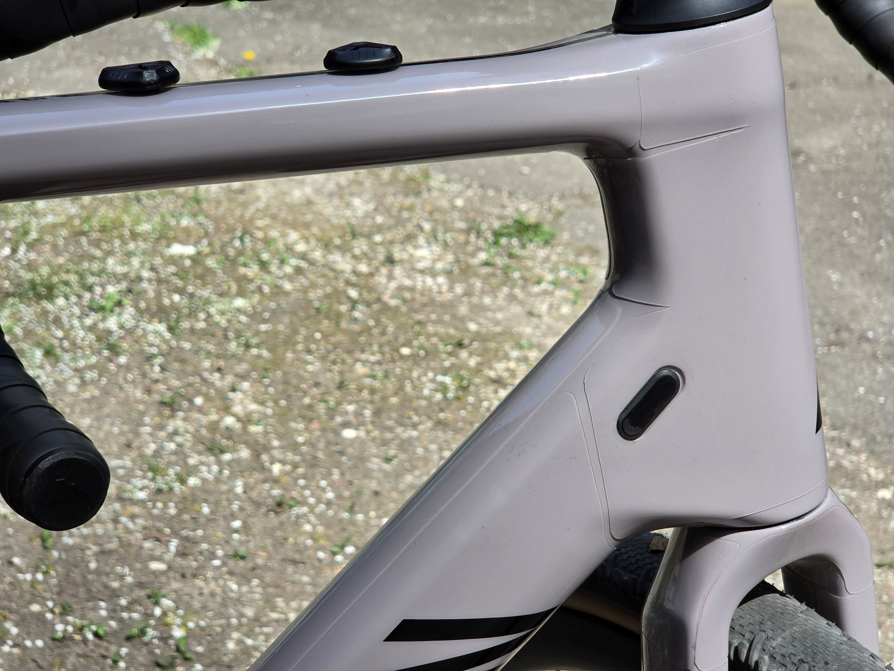

# Canyon Endurace CF8 — Protective Film Cutouts

CAD cutout designs for applying protective film (TPU/vinyl) to the **Canyon Endurace CF8 frame, size M**.
Designed as a free, open-source alternative to commercial protective film kits.

<!-- Replace with an actual render or photo of the film applied to the frame -->

---

## Overview

- **Bike:** [Canyon Endurace CF8](https://www.canyon.com/en-lt/endurace-cf-8-di2/4363.html?dwvar_4363_pv_rahmenfarbe=R076_P10)
- **Frame size:** M
- **Coverage:** 90%+ of the frame
- **Money(?) shots:** [pics](https://github.com/bildukas5/HomeWrap/tree/main/photos)
- **CAD software:** [FreeCAD](https://www.freecad.org/) (free and open source)
- **License:** [CC BY-NC-SA 4.0](https://creativecommons.org/licenses/by-nc-sa/4.0/) — free for personal use, derivatives must stay open

---

## Files

| File | Description |
|---|---|
| `CAD/` | Native FreeCAD `.FCStd` files |
| `photos/` | Results |

---

## Getting Started

1. Download the files from the [Releases](../../releases) page
2. Open `.FCStd` files in [FreeCAD](https://www.freecad.org/) to view or edit
3. Use the exported DXF/SVG files with your vinyl cutter or send to a print shop
4. If you don't have access to proper film cutter, you can resort to printing designs on paper and tracing them with snap-off blade (just as I did!)

---

## Areas for improvement

1. I was working with 150 mm wide tape. Down Toube would benefit from 180 mm wide tape, Head Tube could use 160 mm.
2. Small, irregulary shaped patches went directly from masking tape to cutouts. No CAD files were made. Sorry!
3. Some corners were not properly rounded in CAD files. Make sure you don't leave any sharp corners as those will be first to peal off.
4. Some lines were not properly trimmed. Sorry!

---

## FAQ

**Is this as good as BrandWrap $200 kit?**
- No. This is an amateur first attempt at CAD design and bike protection. If you want professional results, buy a professional product.

**Is it better than BrandWrap $70 kit?**
- Possibly. It offers 90%+ frame coverage and is tailored specifically to this frame rather than being a generic cut.

**Can it be adapted to a different frame size?**
Probably, with some effort:
- **Fork and Chain Stay(?)** — should work without modification on any full-size wheel frame
- **Down Tube** — straightforward to make longer or shorter
- **Seat Tube and other parts** — may require more significant adjustments

---

## ⚠️ Disclaimer

- **No fit guarantee.** These designs were created for a specific Canyon Endurace CF8 frame size M. Frame tolerances, production batches, and measurement variations mean the cutouts may not fit your bike perfectly. **Always do a test run with paper or cheap material before cutting expensive PPF or vinyl film.**
- **Use at your own risk.** The author is not responsible for any damage to your bike, frame, components, or paint caused by the application, removal, or use of protective film based on these designs.
- **Film application can cause damage.** Improper application or removal of protective film can damage paint, carbon fiber, or decals. If in doubt, consult a professional.
- **No warranty.** These files are provided "as is", without warranty of any kind, express or implied. The author makes no guarantees about accuracy, fitness for purpose, or suitability for any particular use.
- **Not a professional product.** This is an amateur project. For critical protection or professional results, consider buying a professionally made kit.

---

## Contributing

Found an issue or improved the fit? Contributions are welcome!
Please open an [Issue](../../issues) or submit a Pull Request.
All contributions must be shared under the same [CC BY-NC-SA 4.0](https://creativecommons.org/licenses/by-nc-sa/4.0/) license.

---

## License

This project is licensed under **Creative Commons Attribution-NonCommercial-ShareAlike 4.0 International**.
You are free to use, share, and adapt these files for **personal, non-commercial use**, as long as you credit the original and share any modifications under the same license.

[View full license →](https://creativecommons.org/licenses/by-nc-sa/4.0/)
